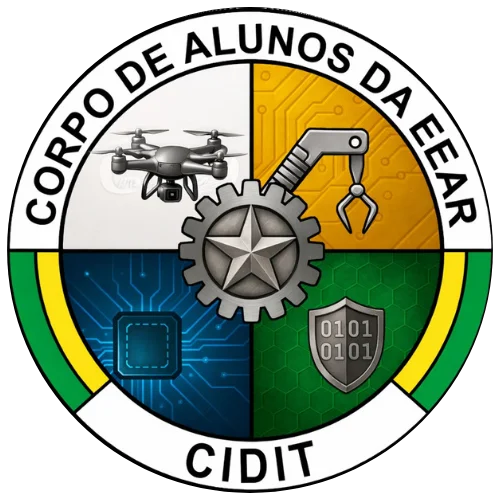
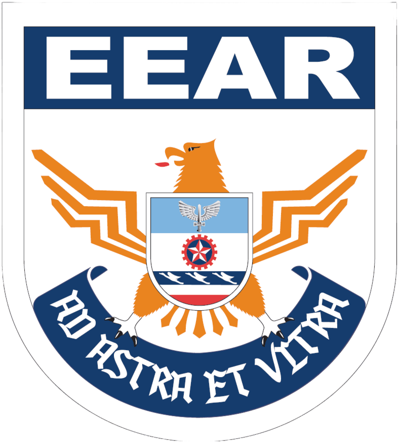

  
  

<h1 align="center">Argos</h1>

<strong>Controle eletrônico de faltas do Corpo de Alunos — EEAR</strong>

  Projeto do <a href="https://github.com/CIDIT-ARGOS">CIDIT</a> · Esquadrão Prata

---

## O que é o Argos

O Argos substitui a chamada de presença em papel por um sistema eletrônico simples. O militar responsável abre a chamada, marca presença ou falta de cada aluno e o sistema já gera o registro com data, hora e protocolo — sem planilha, sem papel, sem retrabalho.

O nome vem da vigia constante do efetivo, como o gigante da mitologia grega que nunca dormia.

## Como funciona, em resumo

- **Painel de Comando** — onde comandantes, encarregados e auxiliares abrem retiradas de falta, consultam o efetivo e tiram relatórios. Cada cargo vê só o que precisa (o comando de esquadrão vê seu esquadrão; o CA vê tudo).
- **Grupos especiais** (como o próprio CIDIT) — para atividades que cruzam esquadrões, fora da chamada normal por esquadrilha.
- **API** — para uso futuro por aplicativo, com chave de acesso própria.
- **Painel técnico** — administração do sistema: backups, chaves de API e usuários.

## Tecnologia

PHP + MySQL, hospedado na Hostinger. Sem frameworks — simples de manter e de dar continuidade.

## Equipe do projeto

| | Nome | Função |
|---|---|---|
|  | AL 26/3138 SIN Simioni | Encarregado do projeto |
|  | AL 26/3119 SIN Santana | Desenvolvedor |
|  | AL 26/3103 SIN Menezes | Desenvolvedor |
|  | AL 26/3118 SIN Gabriel | Desenvolvedor |

---

Corpo de Alunos · Esquadrão Prata · EEAR

